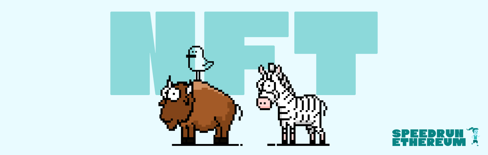
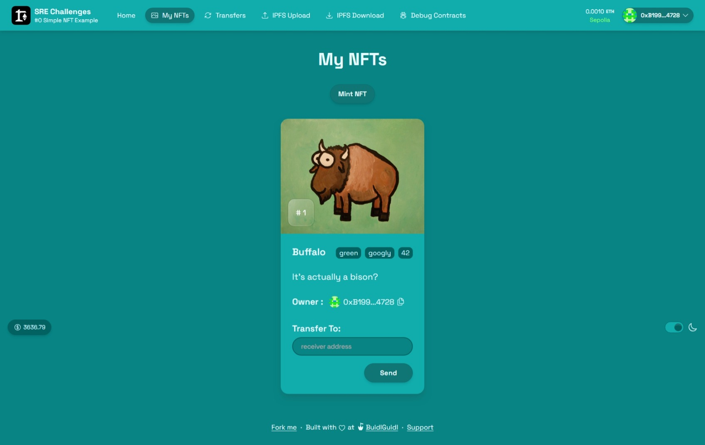

# 🛠 Proyecto – Módulo 4: Simple NFT (Challenge 0)



## 📦 Descripción

Este proyecto forma parte del Módulo 4 del Taller de Solidity organizado por Ethereum Bolivia.

Como reto práctico del módulo, se nos asignó completar el **Challenge 1 de [SpeedRunEthereum](https://speedrunethereum.com/)**, que consiste en un sistema básico para desplegar y visualizar NFTs, permitiendo a los usuarios **mintear y transferir tokens no fungibles (NFTs)** en la red Sepolia.

- 🔗 [Link al Challenge 0](https://speedrunethereum.com/challenge/simple-nft-example)

## ⚙️ Funcionalidades

- ✅ Mint de NFTs mediante botón `MINT NFT`
- ✅ Transferencia de NFTs a otras direcciones desde la interfaz
- ✅ Visualización de NFTs propios en el dashboard
- ✅ Frontend integrado con la red Sepolia
- ✅ Despliegue a Vercel para visualización pública

## 🧪 Pruebas realizadas

1. ✅ Despliegue exitoso del contrato `YourCollectible.sol` en Sepolia.
2. ✅ Pruebas de mint de múltiples NFTs desde interfaz web.
3. ✅ Transferencia de NFTs entre usuarios usando la interfaz.
4. ✅ Visualización en BlockScout y OpenSea Testnets.
5. ✅ Deploy correcto del frontend con Vercel.

## 📤 Despliegue

- Red: Sepolia
- Dirección del contrato: [`0x24f0373CA86ab63814f7c9c30AFd3C09908021F5`](https://sepolia.etherscan.io/address/0x24f0373CA86ab63814f7c9c30AFd3C09908021F5)
- Usuario principal: [`0xb1995e2ba0e918ca97e6861b992124c06b224728`](https://sepolia.etherscan.io/address/0xb1995e2ba0e918ca97e6861b992124c06b224728)
- Visualización de Token NFT: [Blockscout](https://eth-sepolia.blockscout.com/token/0x24f0373CA86ab63814f7c9c30AFd3C09908021F5)
- Frontend desplegado: [Vercel](https://nextjs-86sjdarj7-cisn3ronautas-projects.vercel.app/)



## 🧠 Consideraciones técnicas

- Uso de Scaffold-ETH 2 para generación de frontend y backend
- Generación de wallets burner y conexión dinámica a Sepolia
- Uso de `yarn deploy`, `yarn generate`, `yarn vercel` para automatizar flujo
- Implementación con `YourCollectible.sol` siguiendo el patrón ERC721

## 📁 Estructura del archivo

🔗 Repositorio en GitHub: [challenge-0-simple-nft](https://github.com/moises-cisneros/challenge-0-simple-nft)

```bash
challenge-0-simple-nft/
├── packages/
│   ├── hardhat/ (contratos)
│   └── nextjs/ (frontend)
````

## 👨‍💻 Autor

- Nombre: Moises Cisneros
- Taller: Ethereum Bolivia – Módulo 4
- Año: 2025

## 📜 Licencia

Este proyecto está bajo la Licencia MIT.
