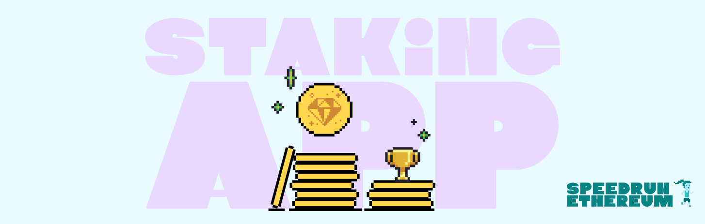
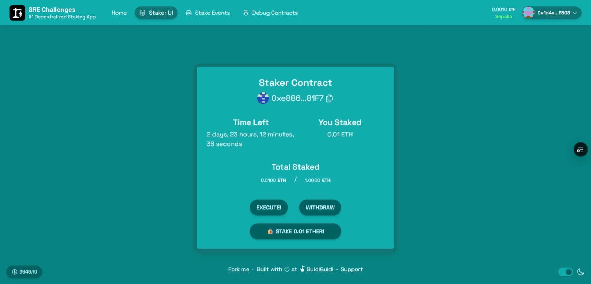

# 🛠 Proyecto – Módulo 4: Staking Descentralizado (Challenge 1)



## 📦 Descripción

Este proyecto forma parte del Módulo 4 del Taller de Solidity organizado por Ethereum Bolivia.

Como reto práctico del módulo, se nos asignó completar el **Challenge 1 de [SpeedRunEthereum](https://speedrunethereum.com/)**, que consiste en implementar un sistema de staking donde los usuarios pueden aportar ETH antes de una fecha límite. Si el total alcanza un umbral predefinido, los fondos se transfieren a un contrato externo. Si no, los usuarios pueden retirar su aporte.

- 🔗 [Link al Challenge 1](https://speedrunethereum.com/challenge/decentralized-staking)

## ⚙️ Funcionalidades

- ✅ Función `stake()` para depositar ETH y participar
- ✅ Función `execute()` para determinar el resultado al finalizar el tiempo
- ✅ Función `withdraw()` en caso de no alcanzar el umbral
- ✅ Contrato externo `ExampleExternalContract` que recibe fondos si el objetivo se cumple
- ✅ Visualización de participantes y estado de ejecución

## 🧪 Pruebas realizadas

1. ✅ Aporte de múltiples usuarios mediante `stake()`
2. ✅ Simulación de éxito con ejecución a contrato externo
3. ✅ Simulación de fracaso y posterior `withdraw()` para cada usuario
4. ✅ Verificación de evento `Stake(address,uint256)`
5. ✅ Deploy de frontend en Vercel conectado al contrato

## 📤 Despliegue

- Red: Sepolia
- Dirección del contrato: [`0xe886d0e04db740e1f4b507d4c5166830dd7481f7`](https://sepolia.etherscan.io/address/0xe886d0e04db740e1f4b507d4c5166830dd7481f7)
- Usuario principal: [`0x1d4a2afdcd598ba9f190a31ada5605bfa818e808`](https://sepolia.etherscan.io/address/0x1d4a2afdcd598ba9f190a31ada5605bfa818e808)
- Frontend desplegado: [Vercel](https://nextjs-apmbljag9-cisn3ronautas-projects.vercel.app/)



## 🧠 Consideraciones técnicas

- Implementación de `mapping(address => uint)` para controlar balance
- Umbral definido como `1 ether` (constante)
- Lógica de tiempo usando `block.timestamp`
- Frontend personalizado para deadlines de 72 horas
- Modificación mínima en Scaffold-ETH 2 (frontend)

## 📁 Estructura del archivo

🔗 Repositorio en GitHub: [challenge-1-decentralized-staking](https://github.com/moises-cisneros/challenge-1-decentralized-staking)

```bash
challenge-1-decentralized-staking/
├── packages/
│   ├── hardhat/ (contratos)
│   └── nextjs/ (frontend)
````

## 👨‍💻 Autor

- Nombre: Moises Cisneros
- Taller: Ethereum Bolivia – Módulo 4
- Año: 2025

## 📜 Licencia

Este proyecto está bajo la Licencia MIT.
